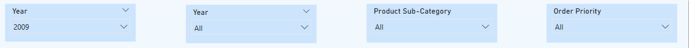

# Sales-Performance-Analysis
Analyze sales performance data using Power BI to gain insights into order trends, revenue, and customer contributions. Dynamic dashboards provide an overview, segment/category analysis, and detailed insights, helping stakeholders make data-driven decisions to optimize operations and improve customer satisfaction.

## Features
- **Monthly Order Count**: Displays the number of orders for each month.
- **Sales By Segment & Category**: Shows sales figures segmented by Furniture, Office Supplies, and Technology categories.
- **Monthly Sales Trend**: Illustrates the trend of monthly sales over time.
- **Top 10 Customers by Sale**: Lists the top 10 customers based on total sales amount.
- **Top 10 Customers by Profit**: Lists the top 10 customers based on total profit amount.
- **Top 10 Products by Profit**: Lists the top 10 products based on total profit amount.

  ## Slicers
  The dashboard includes four slicers to filter the data:
  * Year
  * Year - Quartes
  * Product Sub-Category
  * Order Priority

   

  ## Visual Elements

**1. Monthly Order Count**

   

**2. Sales By Segment & Category**

   

**3. Monthly Sales Trend**

   

**4. Top 10 Customers by Sale**

  

**5. Top 10 Customers by Profit**

**6. Top 10 Products by Profit**

